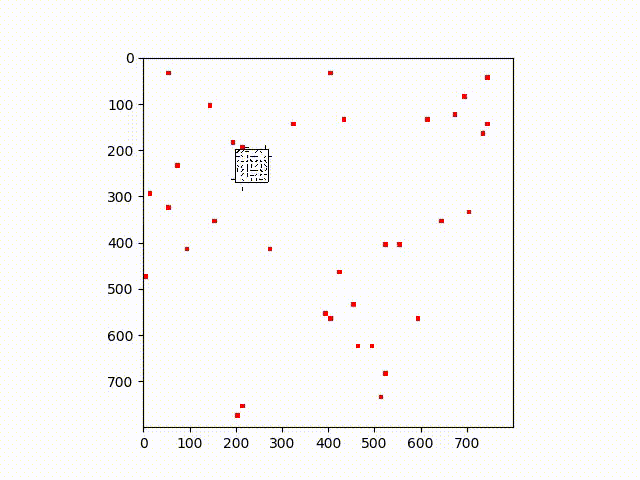

# Ant colony simulation

This is a Python adaptation of [this](https://practicingruby.com/articles/ant-colony-simulation)
Ruby implementation (which in turn is a port of [this](https://gist.github.com/michiakig/1093917) Clojure version)

I know, it's going pretty far in terms of adaptations, but it's still preserving the interesting properties.

The setup is pretty simple - install the packages with `pip install -r requirements.txt`

It's pretty barebones and I'm not sure if I will continue developing it (if I will, I'll likely rewrite it from scratch),
but you can run `python main.py` and generate your own ant colony!

Here's a taste of what can happen, visualized via matplotlib:

